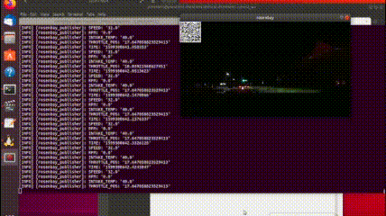

# ros2senbay
ros2senbay is a movie player that serves senbay-data via ros2 message.

## Enviroment
ros2senbay tested on
- Ubuntu 18.04 LTS
- ROS2 Dashing Diademata

## Install
### Install dependance libraries

You need to install `ROS2 Dashing Diademata`, `Zbar` and some python modules to your enviroment.

#### ROS2 Dashing Diademata
```
$ curl -s https://raw.githubusercontent.com/ros/rosdistro/master/ros.asc | sudo apt-key add -
$ sudo apt install ros-dashing-desktop
$ sudo apt install python3-colcon-common-extensions
$ sudo apt install python3-argcomplete
$ echo "source /opt/ros/dashing/setup.bash" >> ~/.bashrc
```

#### Zbar
```
$ sudo apt install -y zbar-tools
```
#### Python modules
- opencv-python
- zbar

You can install following dependences via `pip`.

```
$ pip install opencv-python
$ pip install zbar
```

## Usage

```sh
$ ros run ros2senbay
```


## Reference

```
@inproceedings{Nishiyama:2018:SPI:3236112.3236154,
  author = {Nishiyama, Yuuki and Dey, Anind K. and Ferreira, Denzil and Yonezawa, Takuro and Nakazawa, Jin},
  title = {Senbay: A Platform for Instantly Capturing, Integrating, and Restreaming of Synchronized Multiple Sensor-data Stream},
  booktitle = {Proceedings of the 20th International Conference on Human-Computer Interaction with Mobile Devices and Services Adjunct},
  series = {MobileHCI '18},
  year = {2018},
  location = {Barcelona, Spain},
  publisher = {ACM},
}
```

## License
ros2senbay is available under the Apache License, Version 2.0 license. See the LICENSE file for more info.