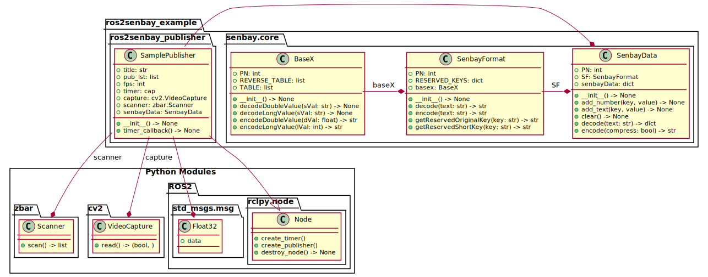

# ros2senbay
ros2senbay is a ros2 publisher generator that serves senbay-data via ros2 message.

## Enviroment
ros2senbay tested on
- Ubuntu 18.04.5 LTS (Bionic Beaver)
- ROS2 dashing

## Install
### Installing dependencies

You need to install `ROS2 dashing`, `Zbar` and some python modules to your enviroment.

#### ROS2 dashing
```
$ curl -s https://raw.githubusercontent.com/ros/rosdistro/master/ros.asc | sudo apt-key add -
$ sudo apt install -y ros-dashing-desktop
$ sudo apt install -y python3-colcon-common-extensions
$ sudo apt install -y python3-argcomplete
$ echo "source /opt/ros/dashing/setup.bash" >> ~/.bashrc
```

#### Zbar
```
$ sudo apt install -y zbar-tools
```
#### Python modules
If you have not installed `python3` yet, please follow the instructions below.

```
$ sudo apt install -y python3
$ sudo apt install -y python3-pip
```

You can install following dependences via `pip3`.

- scikit-build
- numpy
- opencv-python
- zbar-py
- prestring
- tqdm

```
$ pip3 install scikit-build
$ pip3 install numpy
$ pip3 install opencv-python
$ pip3 install zbar-py
$ pip3 install prestring
$ pip3 install tqdm
```

### Build from source

```
$ mkdir -p ~/ros2senbay_ws/src
$ cd ~/ros2senbay_ws/src
```

Clone this repository and build

```
$ git clone https://github.com/haradama/ros2senbay.git
$ colcon build ros2senbay [--merge-install]
```

## Example
This is a example of ros2senbay. The sensor-data is derived from vehicle via OBD-II.

### Architecture



### Usage

```
$ cd ./example
$ colcon build --packages-select ros2senbay_publisher --symlink-install
$ . install/setup.bash
$ ros2 run ros2senbay_publisher play
```


## Reference

```
@inproceedings{Nishiyama:2018:SPI:3236112.3236154,
  author = {Nishiyama, Yuuki and Dey, Anind K. and Ferreira, Denzil and Yonezawa, Takuro and Nakazawa, Jin},
  title = {Senbay: A Platform for Instantly Capturing, Integrating, and Restreaming of Synchronized Multiple Sensor-data Stream},
  booktitle = {Proceedings of the 20th International Conference on Human-Computer Interaction with Mobile Devices and Services Adjunct},
  series = {MobileHCI '18},
  year = {2018},
  location = {Barcelona, Spain},
  publisher = {ACM},
}
```

## License
ros2senbay is available under the Apache License, Version 2.0 license. See the LICENSE file for more info.